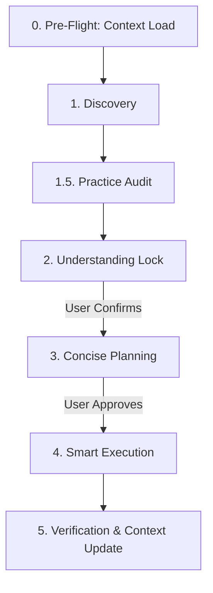
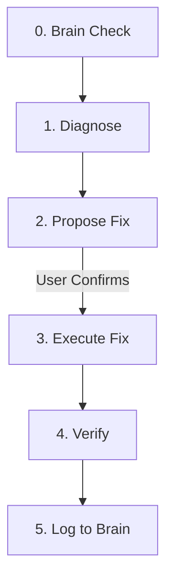

# ThinkTank: Antigravity CLI Context & Execution-based Skill

[](#versioning)
[](LICENSE)

ThinkTank is a strategic reasoning and execution framework designed for Antigravity CLI. It enforces a strict, high-leverage software engineering lifecycle that prevents misalignment, reduces cognitive/token bloat, and guarantees high-quality, production-ready code.

It is highly optimized for building modern React web frontends (Vite, Bulletproof Architecture, Zustand, TanStack Query) and React Native mobile frontends (Expo, Expo Router).

---

## 🌀 ThinkTank Lifecycles

### 1. Main Workflow Lifecycle (`thinktank`)
A highly structured multi-phase protocol for planning, reviewing, and building new features or refactoring codebase architecture:



*   **0. Context Load**: Instantly reads persistent context files (`brain.md`, `design.md`, `product.md`, `plans.md`) from the workspace root to bypass repetitive codebase scans.
*   **1. Discovery**: Runs targeted code scans and isolates components or patterns before asking questions.
*   **1.5. Practice Audit (Gate)**: Evaluates requested implementations against a strict checklist of platform-specific anti-patterns (e.g., laggy tab rendering, inline styles inside maps, missing safe areas).
*   **2. Understanding Lock**: Aligns objectives, reuse patterns, risks, and proposed direction, blocking execution until the user confirms.
*   **3. Concise Planning**: Drafts a checklist-based implementation plan.
*   **4. Smart Execution**: Surgically updates targeted files.
*   **5. Verification & Context Update**: Runs linting/compilation checks and logs major learnings/fixes back into the persistent context files.

### 2. Diagnostic & Fix Lifecycle (`thinktank:debug`)
A specialized workflow that auto-triggers on error keywords, layout issues, or type mismatches:



*   *Strict Rule*: Operates on a **one-phase-per-turn** protocol to keep debugging changes highly controlled and visible to the developer.

---

## 📁 Repository Structure

```text
ThinkTank-Antigravity-CLI-Context-Execution-based-Skill/
├── README.md
├── thinktank/
│   ├── SKILL.md            # Main ThinkTank v2 system instructions
│   ├── examples/
│   │   └── templates.md    # Markdown templates for Discovery, Planning, and Context
│   └── references/
│       ├── react_vite_expo_guidelines.md   # Front-end React/Vite/Expo best practices
│       └── git_guidelines.md               # Conventional commits, atomic strategy, git bisect
└── thinktank-debug/
    └── SKILL.md            # ThinkTank:Debug diagnostic instruction rules
```

---

## 🛠️ Frontend & Version Control Best Practices

This repository incorporates comprehensive industry-standard guidelines:

### React + Vite (Web Frontend)
*   **Feature-Based Module Encapsulation**: Organizing directories by feature domain (`features/feature-name`) rather than file type to reduce tight coupling.
*   **Server vs. Client State separation**: Handling UI states via Zustand/Context and server caching via TanStack Query, explicitly discouraging `useEffect` fetch hooks.

### React + Expo (Mobile Frontend)
*   **Layout and Overflow Prevention**: ScrollView/FlatList wrappers, `flexShrink: 1` horizontal row rules, and dynamic KeyboardAvoidingView configurations.
*   **Persistent Tab Mounting**: Mounting navigation tabs persistently with `display` toggling rather than conditional mounts to eliminate rendering lag.

### Git & Version Control
*   **Conventional Commit Formatting**: Structuring messages (`feat`, `fix`, `chore`, `docs`) to ensure readability.
*   **Atomic Strategy**: Commit selective, independent changes to enable simple reverts and clean git history logs.
*   **Git Bisect**: Systematically finding breaking commits via automated binary search.

---

## 🔄 Versioning

Both skills are versioned in their frontmatter:
*   `thinktank` v2.1.0
*   `thinktank:debug` v2.1.0

This allows the CLI agent to detect outdated configurations and fetch version updates seamlessly.