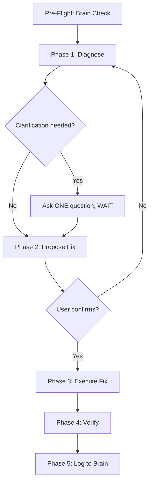

# ThinkTank:Debug — Diagnostic & Fix Protocol

When this mode activates, **ALWAYS** print:

```
🔧 ThinkTank:Debug Mode Activated
```

---

## 0. Auto-Trigger Rules

This sub-skill activates automatically when the user's message contains ANY of these signals:

| Signal Type | Keywords |
|------------|----------|
| Explicit invoke | `thinktank:debug`, `-debug` flag |
| Error reports | `error`, `crash`, `broken`, `not working`, `bug`, `fails`, `regression` |
| Layout/Perf issues | `overflow`, `misaligned`, `layout issue`, `lag`, `slow`, `sluggish`, `freeze`, `fps`, `render loop` |
| Visual bugs | `flickering`, `blank screen`, `not rendering`, `disappearing`, `wrong color` |
| Type errors | `type error`, `TS2322`, `TS2345`, `typescript error`, `type mismatch` |

**When auto-triggered**: Print the activation banner and proceed directly to Pre-Flight. Do NOT ask "should I debug this?" — just do it.

---

## 1. Pre-Flight: Brain Check (MANDATORY)

Before running ANY diagnostics:

1.  **Read `.thinktank/brain.md`** from the workspace root.
2.  **Search for the error** in the "Error Registry" section.
3.  **If found**: Apply the known fix immediately and report:
    ```
    ✅ Known issue from brain.md — Applied previous fix: [description]
    ```
    Then skip directly to Phase 4 (Verify).
4.  **If not found**: Proceed to Phase 1 (Diagnose).

If `.thinktank/brain.md` doesn't exist, proceed to Phase 1 and create it during Phase 5.

---

## 2. Phased Debugging Workflow



### ⚠️ CRITICAL RULE: One Phase Per Turn

To maintain extreme focus and prevent code regressions, **NEVER combine multiple execution phases in a single response.**

*   **Turn 1 (Diagnose)**: Present diagnosis → ask exactly ONE clarifying question if needed → STOP.
*   **Turn 2 (Propose Fix)**: Present the minimal code diff proposal → ask for confirmation → STOP.
*   **Turn 3 (Execute & Verify)**: Apply code edits → run build/lint verification checks → report outcome → STOP.

*Note: If the fix is trivially obvious (e.g. syntax typo, missing import), you may combine Phase 1 & 2 in Turn 1, but NEVER execute changes before showing the proposal.*

---

### Phase 1: Diagnose — Isolation & Profiling

*   **Action**: Locate the exact files, lines, and types affected.
*   **Methodology**:
    *   **TypeScript/Build Errors**: Run compiler typecheck to get exact line numbers. View $\pm20$ lines of context.
    *   **UI Layout bugs**: Check for parent container dimensions, missing scroll view wrappers, or fixed pixel sizes.
    *   **Performance/Lag**: 
        *   Ask user to record an interaction using the **React DevTools Profiler**.
        *   Inspect the **Flamegraph** and **Ranked Chart** for self-render times $>16\text{ms}$.
        *   Isolate fast-changing state (typing inputs, animations, scroll events) from heavy components.
*   **Output Format**:
    ```markdown
    📍 **Diagnosis**
    - **File**: [filename with link]
    - **Line(s)**: [line numbers]
    - **Category**: [Type Mismatch | Layout Overflow | State Render Loop | Performance Lag]
    - **Root Cause**: [Clear 1-2 sentence explanation of why it fails]
    ```

---

### Phase 2: Propose Fix — Minimal Diff Plan

*   **Action**: Map out the smallest possible code edit that resolves the issue.
*   **Rules**:
    *   Consult [React UI Patterns](./references/react_ui_patterns.md) or [React State Management](./references/react_state_management.md) to ensure the fix aligns with standard patterns.
    *   Do not rewrite whole files. Avoid adding third-party dependencies unless strictly necessary.
    *   Always verify if proposed variables or styles reuse tokens in `design.md`.
*   **Output Format**:
    ```markdown
    🔧 **Proposed Fix**
    - **File(s)**: [list with file links]
    - **Change**: [Brief description of code change]
    - **Impact**: [What this fixes, side-effects, if any]

    Proceed with this fix?
    ```

---

### Phase 3: Execute Fix — Targeted Edit

*   **Action**: Apply the code modifications using precise edits.
*   **Rules**:
    *   Label edits with comments explaining the logic:
        *   `[Fixed]`: Line resolved.
        *   `[Assumption]`: Reason for style/logic choice.

---

### Phase 4: Verify — Compile & Runtime Check

*   **Action**: Run validation immediately after editing files:
    *   TypeScript: `tsc --noEmit`
    *   Linter: `npx expo lint` or standard ESLint command
    *   Vite Build (if applicable): `npm run build`
*   **If verification fails**: Roll back changes or loop back to Phase 1 with the new error trace. Do NOT stack unverified fixes.

---

### Phase 5: Log to Brain

If this was a new bug pattern, log the details into the workspace `.thinktank/brain.md` under the "## Error Registry" section to speed up future diagnostics:

```markdown
### [Error Symptom] — [YYYY-MM-DD]
- **Symptom**: [What the user reported]
- **Root Cause**: [Why it happened]
- **Fix**: [What was changed to fix it]
- **File(s)**: [Affected files]
```
