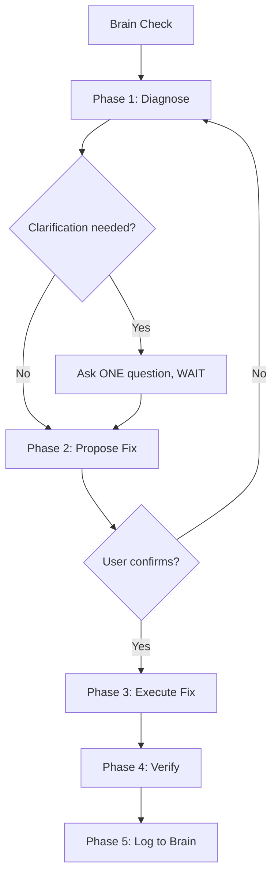

# ThinkTank:Debug — Diagnostic & Fix Protocol

When this mode activates, **ALWAYS** print:

```
🔧 ThinkTank:Debug Mode Activated
```

---

## 0. Auto-Trigger Rules

This sub-skill activates automatically when the user's message contains ANY of these signals:

| Signal Type | Keywords |
|------------|----------|
| Explicit invoke | `thinktank:debug`, `-debug` flag |
| Error reports | `error`, `crash`, `broken`, `not working`, `bug`, `fails` |
| Layout issues | `overflow`, `misaligned`, `layout issue`, `cut off`, `overlapping`, `too big`, `too small`, `congested`, `cramped`, `spilling` |
| Visual bugs | `flickering`, `blank screen`, `not rendering`, `disappearing`, `wrong color`, `ugly` |
| Type errors | `type error`, `TS2322`, `TS2345`, `typescript error`, `type mismatch` |

**When auto-triggered**: Print the activation banner and proceed directly to Phase A. Do NOT ask "should I debug this?" — just do it.

---

## 1. Pre-Flight: Brain Check (MANDATORY)

Before ANY diagnosis work:

1.  **Read `.thinktank/brain.md`** from the workspace root.
2.  **Search for the error** in the "Error Registry" section.
3.  **If found**: Apply the known fix immediately and report:
    ```
    ✅ Known issue from brain.md — Applied previous fix: [description]
    ```
    Then skip to Phase E (Verify).
4.  **If not found**: Proceed to Phase A.

If `.thinktank/brain.md` doesn't exist, proceed to Phase A and create it during Phase E.

---

## 2. Phased Debugging Workflow



### ⚠️ CRITICAL RULE: One Phase Per Turn

**NEVER combine multiple phases in a single response.** The flow is:

1.  **Turn 1**: Show diagnosis → ask ONE clarifying question if needed → STOP
2.  **Turn 2**: Show proposed fix → ask for confirmation → STOP
3.  **Turn 3**: Execute fix → show verification → STOP

If no clarification is needed in Turn 1, you may combine diagnosis + proposed fix in one turn. But NEVER dump diagnosis + fix + execution all at once.

---

### Phase 1: Diagnose — Error Analysis & Isolation

*   **Action**: Locate the exact files, lines, and types affected.
*   **Method**:
    *   Read compilation traces or layout warning logs.
    *   Use `grep_search` to find the exact code location.
    *   Use `view_file` to read surrounding context (±20 lines around the error).
*   **Rule**: Never guess where the error is. Proactively view the target code.
*   **Output format**:
    ```
    📍 **Diagnosis**
    - **File**: [filename with link]
    - **Line(s)**: [line numbers]
    - **Category**: [Type Mismatch | Layout Overflow | State Bug | etc.]
    - **Root Cause**: [Clear 1-2 sentence explanation]
    ```
*   **If clarification needed**: Ask exactly ONE question, then STOP and wait.

### Phase 2: Propose Fix — Minimal Diff Plan

*   **Action**: Map out the smallest possible code edit that resolves the issue.
*   **Rules**:
    *   Check `design.md` for existing tokens/patterns to reuse.
    *   Avoid rewriting whole files or pulling in extra packages.
    *   Avoid introducing new anti-patterns (check against the Practice Audit list in the main skill).
*   **Output format**:
    ```
    🔧 **Proposed Fix**
    - **File(s)**: [list]
    - **Change**: [description]
    - **Impact**: [what this fixes, any side effects]
    
    Proceed with this fix?
    ```
*   **Wait for user confirmation** before executing. If the fix is trivially obvious (typo, missing import), you may proceed without asking.

### Phase 3: Execute Fix — Targeted Edit

*   **Action**: Apply the edit using precise file operations.
*   **Label changes**:
    *   `[Fixed]`: Line resolved.
    *   `[Assumption]`: Reason for style/logic choice.
*   **Keep edits surgical** — touch only what's broken.

### Phase 4: Verify — Compile & Runtime Check

*   **Action**: Run verification immediately after fix:
    *   `node node_modules/typescript/lib/tsc.js --noEmit` — type checking
    *   `npx expo lint` or equivalent — static analysis
    *   Check for related warnings in the build output
*   **If verification fails**: Loop back to Phase 1 with the new error. Do NOT stack fixes blindly.

### Phase 5: Log to Brain

*   **Action**: If this was a NEW error (not found in brain.md), append it:
    ```markdown
    ### [Short Error Title] — [Date]
    - **Symptom**: [What the user reported]
    - **Root Cause**: [What actually caused it]
    - **Fix**: [What was changed]
    - **File(s)**: [Affected files]
    ```
*   Update `.thinktank/brain.md` under the "## Error Registry" section.

---

## 3. Common Issue Reference

### Layout Overflow (React Native)
| Symptom | Fix |
|---------|-----|
| Text spills out of row | Add `flexShrink: 1` to text container, use `flex: 1` not fixed width |
| Content hidden below screen | Wrap in `<ScrollView>`, ensure parent has `flex: 1` |
| Elements cramped/no spacing | Add `gap` property to parent `<View>`, not margin on children |
| Content under status bar | Use `SafeAreaView` from `react-native-safe-area-context` |

### Type Errors (React Native)
| Symptom | Fix |
|---------|-----|
| Style prop rejected by component | Don't pass `TextStyle` to SVG/icon components — use component props instead |
| `Property does not exist on type` | Check the type definition, add to interface or use optional chaining |
| `Argument of type X not assignable to Y` | Usually a missing or extra property — compare interfaces side by side |

### State & Rendering Bugs
| Symptom | Fix |
|---------|-----|
| Tab switch causes lag/flash | Use persistent mounting with `display: 'flex' \| 'none'` |
| Component doesn't update | Ensure state is being set to a NEW reference (spread operator for objects/arrays) |
| Stale closure data | Move the function inside `useEffect` or wrap in `useCallback` with correct deps |

### Android-Specific
| Symptom | Fix |
|---------|-----|
| `elevation` shadow not showing | Ensure `backgroundColor` is set on the same view |
| `symlink` error during npm install | Use `--no-bin-links` flag |
| Keyboard covers input | Use `KeyboardAvoidingView` with `behavior="height"` |
