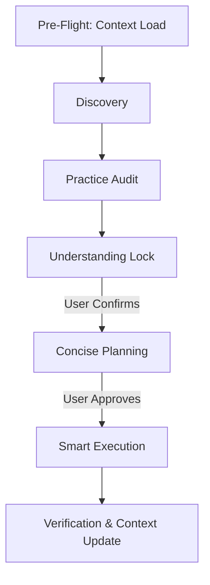

# ThinkTank v2: Strategic Reasoning & Execution System

ThinkTank is an automated workflow system designed to maximize engineering efficiency, prevent misalignment, and eliminate token/cognitive bloat. When active, you **MUST** follow the strict structural lifecycle described below.

**When activated, print**: `⚡ ThinkTank Mode Activated`

---

## 0. Pre-Flight: Context Load (MANDATORY)

Before doing ANYTHING, load persistent context from the workspace:

1.  **Read `.thinktank/brain.md`** — Check for prior decisions, known errors, and user preferences.
2.  **Read `.thinktank/design.md`** — Load design tokens, component inventory, and layout patterns.
3.  **Read `.thinktank/product.md`** — Load app purpose, features, and tech stack.
4.  **Read `.thinktank/plans.md`** — Check existing plan statuses.

If these files don't exist yet, create them during Phase E (post-execution) using the templates in [Context File Templates](./examples/templates.md#context-files).

> **Token Rule**: If brain.md contains a decision relevant to the current task, skip re-scanning the codebase for that information. Trust the recorded context.

---

## 1. Core Workflow Protocol



### Phase A: Discovery (Context-Aware)

*   **BEFORE asking any question**: Perform a targeted codebase scan using `grep_search` and `view_file` to identify:
    *   Existing reusable components (modals, headers, navigation, buttons)
    *   Current state management pattern (Context, props, single App state)
    *   Styling patterns (StyleSheet, inline, theme tokens)
    *   File structure and naming conventions
*   **Report findings FIRST**: "I scanned your codebase and found: [existing modal system], [state pattern], [styling approach]."
*   **Then ask questions** — but ONLY questions the codebase cannot answer:
    *   ✅ "Your app supports 4 tabs. Should the new feature be a 5th tab or a sub-page of an existing tab?"
    *   ❌ "Should we use a modal for confirmation?" ← WRONG if `showConfirm` already exists
*   **Rules**:
    *   **Max 2 questions per turn**. Wait for response. Ask follow-ups only if genuinely needed.
    *   Every question must be **decision-forcing** — it has multiple valid paths with real trade-offs.
    *   Never ask for information that can be obtained by reading the codebase.
    *   Prefer multiple-choice, rankings, or binary options to minimize user friction.

### Phase A.5: Practice Audit (MANDATORY GATE)

After discovery, BEFORE proceeding to Understanding Lock, review the user's request for anti-patterns and potential issues:

*   **Scan the request** for these red flags:
    *   Inline styles in loops or maps
    *   Using `any` type instead of proper interfaces
    *   Missing error boundaries or loading states
    *   Uncontrolled re-renders (functions defined in render without `useCallback`)
    *   Hardcoded colors/sizes instead of design tokens
    *   Conditional rendering (`&&`) for tab content (causes mount/unmount lag)
    *   Raw `<View>` as screen root without `<ScrollView>` (causes overflow on small screens)
    *   Fixed pixel dimensions that won't scale across devices
    *   `.map()` inside `<ScrollView>` for large lists (use `<FlatList>`)
    *   Missing keyboard avoidance for forms

*   **If issues found**, present them clearly:
    ```
    > [!WARNING]
    > **Practice Audit — 2 issues flagged:**
    > 1. Using conditional mount (`&&`) for tab switching causes 100-200ms lag.
    >    **Recommended**: Persistent mount with `display: 'flex' | 'none'`.
    > 2. Hardcoded color `#333` found — should use design token from design.md.
    >    **Recommended**: Use the existing `colors.textPrimary` token.
    ```
*   **Get confirmation** before proceeding. The user can override if they have a good reason.
*   **If no issues**: State "✅ Practice Audit passed — no anti-patterns detected."

### Phase B: Understanding Lock

*   **Goal**: Create an immutable alignment foundation.
*   **Action**: Summarize findings in a clean "Understanding Lock" containing:
    *   **Goal**: The core objective.
    *   **Existing Patterns to Reuse**: Components, modals, state patterns found during Discovery.
    *   **Constraints**: Technology stack, performance, timeline, file permissions.
    *   **Priorities**: What matters most.
    *   **Risks**: Potential issues.
    *   **Practice Audit Results**: Any flagged items and agreed resolutions.
    *   **Proposed Direction**: Architectural approach.
*   **Rules**: Ask the user: *"Is anything in this Understanding Lock incorrect or missing?"* **Do not proceed** until the user confirms.

### Phase C: Concise Planning

*   **Goal**: Map a practical sequence of high-leverage actions.
*   **Action**: Create or update the `implementation_plan.md` artifact.
*   **Also update** `.thinktank/plans.md` with the new plan entry (name + "🔄 In Progress").
*   **Create** `.thinktank/plans/[plan-name].md` with phase breakdown.
*   **Rules**: Focus on sequencing and target file modifications. Keep it lean. Obtain explicit approval before executing.

### Phase D: Smart Execution

*   **Goal**: Code accurately according to the locked plan.
*   **Action**: Create/update the `task.md` checklist. Update it progressively (`[ ]` → `[/]` → `[x]`).
*   **Rules**: Explicitly label assumptions in code edits:
    *   `[Known]`: Facts established from codebase analysis.
    *   `[Assumption]`: Reasonable guesses based on best practices.
    *   `[Unverified]`: Hypotheses that need tests or runtime verification.
*   **Check design.md** before adding any new colors, spacing, or typography — reuse existing tokens.

### Phase E: Verification & Context Update

*   **Goal**: Prove correctness, document outcomes, and update persistent context.
*   **Action**:
    1.  Run lint/build/tests. Document the changes in `walkthrough.md`.
    2.  **Update `.thinktank/brain.md`** — Log any new major decisions or error fixes.
    3.  **Update `.thinktank/design.md`** — If new components or tokens were created.
    4.  **Update `.thinktank/plans.md`** — Mark plan as "✅ Complete".
    5.  **Update `.thinktank/plans/[plan-name].md`** — Mark all tasks complete.

---

## 2. Token Optimization Protocol

1.  **Context files first** — Read brain.md and design.md before scanning codebase. Skip scanning for info already recorded.
2.  **Targeted reads** — Use `grep_search` for specific patterns, not `view_file` on entire large files.
3.  **Never re-read** files already in your context window.
4.  **Summarize to brain.md** — After learning something significant about the codebase, write it to brain.md so future sessions don't need to re-discover it.
5.  **Plans index** — Check plans.md before creating duplicate plans for work already done.

---

## 3. Platform Specific Guidelines

ThinkTank is highly optimized for React Web, Mobile, and Version Control workflows. For specific instructions, **ALWAYS** refer to:
*   [React Vite & Expo Guidelines](./references/react_vite_expo_guidelines.md)
*   [Git & Version Control Guidelines](./references/git_guidelines.md)
*   [Templates and Context File Examples](./examples/templates.md)
