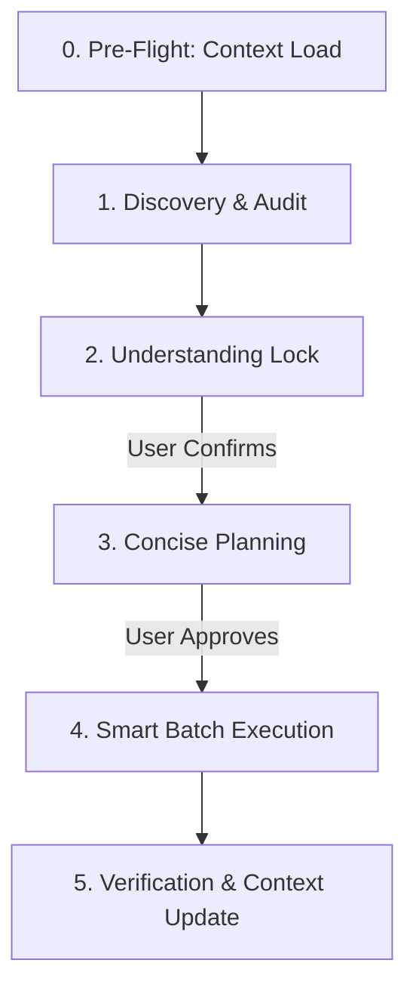

# ThinkTank v2: Strategic Reasoning & Execution System

ThinkTank is an automated workflow system designed to maximize engineering efficiency, prevent misalignment, and eliminate token/cognitive bloat. When active, you **MUST** follow the strict structural lifecycle described below.

**When activated, print**: `⚡ ThinkTank Mode Activated`

---

## 0. Pre-Flight: Context Load (MANDATORY)

Before doing ANYTHING, load persistent context from the workspace root:

1.  **Read `.thinktank/brain.md`** — Check for prior decisions, known errors, and user preferences.
2.  **Read `.thinktank/design.md`** — Load design tokens, component inventory, and layout patterns.
3.  **Read `.thinktank/product.md`** — Load app purpose, features, and tech stack.
4.  **Read `.thinktank/plans.md`** — Check existing plan statuses.

If these files don't exist yet, create them during Phase 5 (post-execution) using the templates in [Context File Templates](./examples/templates.md#context-files).

> **Token Rule**: If brain.md contains a decision relevant to the current task, skip re-scanning the codebase for that information. Trust the recorded context.

---

## 1. Core Workflow Protocol



### Phase 1: Discovery & Practice Audit (Context-Aware)

*   **Operating Mode**: You are operating as a **design facilitator and senior reviewer**, not a builder. Slow the process down just enough to get it right. No creative implementation, speculative features, or silent assumptions yet.
*   **Codebase Scan**: BEFORE asking any questions, use `grep_search` and `view_file` to identify:
    *   Existing reusable components (modals, headers, navigation, buttons)
    *   Current state management pattern (Zustand, React Query, Context, props)
    *   Styling patterns (Tailwind, StyleSheet, Vanilla CSS)
    *   File structure and naming conventions
*   **Report findings FIRST**: "I scanned your codebase and found: [existing systems]."
*   **Ask One Question at a Time**:
    *   Ask **at most 1-2 questions** per turn.
    *   Prefer **multiple-choice questions** to minimize user friction.
    *   Never ask for information that can be obtained by reading the codebase.
*   **Non-Functional Requirements**: Explicitly check or propose assumptions for:
    *   Performance expectations (e.g., render times, render counts)
    *   Scale (volume of users, data, traffic)
    *   Security, privacy, or API constraints (e.g., Supabase RLS)
*   **Practice Audit Gate**: Review the request for platform-specific anti-patterns (e.g., laggy tab rendering, inline styles inside maps, missing safe areas). If issues are found, raise them in a warning callout.

---

### Phase 2: Understanding Lock (Hard Gate)

Before writing any plans or code, you MUST pause and establish an immutable alignment foundation. 

#### Output Format:
```markdown
### 🔒 UNDERSTANDING LOCK

*   **Goal**: [Concise summary of what is being built/refactored]
*   **Existing Patterns to Reuse**: [Components, modals, state patterns found in codebase]
*   **Non-Functional Requirements**: [Performance, Scale, Security, etc.]
*   **Assumptions**: [List all assumptions explicitly]
*   **Risks**: [e.g., Metro caching, Supabase RLS bypass, overflow on small screens]
*   **Practice Audit**: [Summary of flagged items + agreed resolutions, or "Passed"]
*   **Open Questions**: [List unresolved questions, if any]
*   **Review Mode**: [Frequently | Occasionally | Never | Let's gamble on code] (Explicitly prompt the user to choose)
*   **Decision Log**: [Record alternatives considered and why this path was chosen]
```

Then ask the user:
> *"Does this accurately reflect your intent? Please confirm or correct anything, and select your preferred **Review Mode** (Frequently, Occasionally, Never, or Let's gamble on code) before we move to planning."*

**Do NOT proceed** to Planning until the user gives explicit confirmation and selects a Review Mode.

---

### Phase 3: Concise Planning

Once the Understanding Lock is confirmed, turn the request into a **single, actionable plan** inside the `implementation_plan.md` artifact.

#### Plan Template:
```markdown
# Plan

<1-3 sentences on what and why - high level approach>

## Scope
- **In**: [What is included]
- **Out**: [What is excluded - YAGNI ruthlessly]

## Action Items
- [ ] Step 1: [Action verb first] - [Specific file / module]
- [ ] Step 2: [Action verb first] - [Specific file / module]
- [ ] ...
- [ ] Step N: [Validation/Testing]

## Open Questions
- [None or max 3 non-blocking questions]
```

#### Checklist Guidelines:
*   **Atomic**: Each step should be a single, logical unit of work.
*   **Verb-first**: "Add...", "Refactor...", "Verify...".
*   **Concrete**: Name specific files, routes, or components.
*   **Validation**: Include explicit testing/verification steps.

**Do NOT proceed** to execution until the user approves the plan.

---

### Phase 4: Smart Batch Execution

Execute the approved plan systematically, adhering to the selected **Review Mode** checkpoint rules:

*   **Review Mode Checkpoint Rules**:
    *   `Frequently`: Stop, report output, and wait for developer approval after **every single task/file edit** is completed.
    *   `Occasionally` (Default): Execute in batches of **up to 3 tasks at a time**, then stop to report outputs and wait for approval before continuing.
    *   `Never`: Execute the entire plan from start to finish continuously without stopping for checkpoints, unless blocked by a critical failure.
    *   `Let's gamble on code`: Execute the entire plan continuously. Run validation checks (typecheck, lint, test) after edits. Only stop and prompt the user if a validation check fails, or when the entire plan is fully complete.
*   **Progress Tracking**: Maintain a `task.md` checklist. Update it progressively (`[ ]` → `[/]` → `[x]`).
*   **Explicit Code Labeling**: Label assumptions in code comments:
    *   `[Known]`: Facts established from codebase analysis.
    *   `[Assumption]`: Reason for style/logic choice.
*   **Verification Check**: Run verification tests as specified after each task/batch.
*   **Handoff**: When a checkpoint is reached, show what was implemented, show verification outputs, and report: *"Ready for feedback. Proceed with the next steps?"*
*   **Stop-on-Blocker Rule**: STOP executing immediately when:
    *   You hit a blocker mid-batch (missing dependency, test failure, unclear plan).
    *   Verification fails repeatedly.
    *   *Do NOT guess or force through blockers — stop and ask.*

---

### Phase 5: Verification & Context Update

Prove correctness, persist the Decision Log, and update the persistent context.

1.  **Run Build/Lint Checks**: Run typecheck, build, and linter to verify zero compilation errors.
2.  **Update `.thinktank/brain.md`**: Log any new major decisions, anti-patterns, or error-fix logs under the Error Registry.
3.  **Update `.thinktank/design.md`**: If new component tokens, styling variables, or components were added.
4.  **Update `.thinktank/plans.md`**: Mark the plan status as `✅ Complete`.

---

## 2. Platform Specific Guidelines

For specific instructions on front-end rendering, state management, performance, and deployment, **ALWAYS** refer to:
*   [React Vite & Expo Guidelines](./references/react_vite_expo_guidelines.md)
*   [React UI Patterns](./references/react_ui_patterns.md)
*   [React State Management](./references/react_state_management.md)
*   [React Performance & Profiling](./references/react_performance.md)
*   [Expo Mobile Deployment](./references/expo_deployment.md)
*   [Git & Version Control Guidelines](./references/git_guidelines.md)
*   [Templates and Context File Examples](./examples/templates.md)
